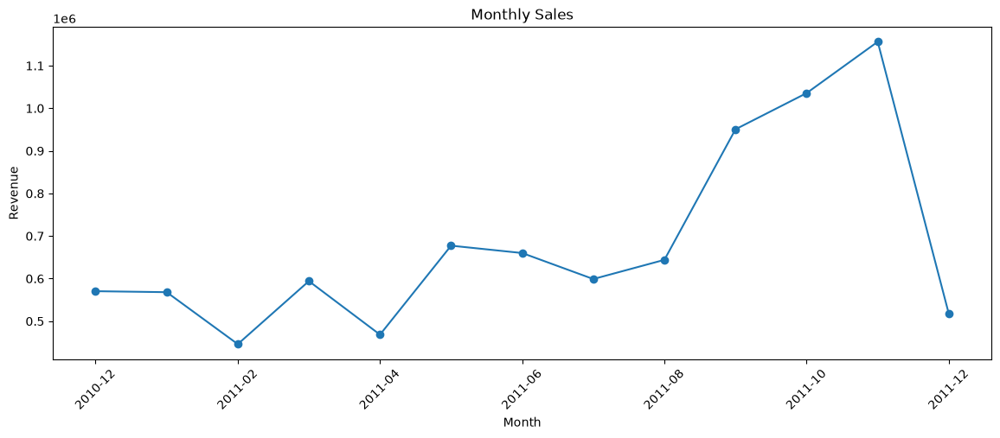
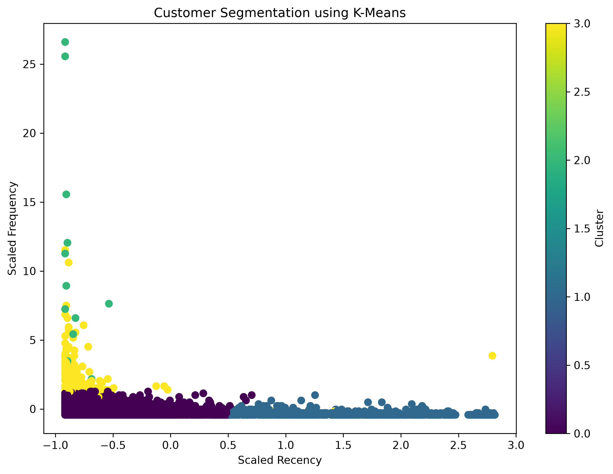
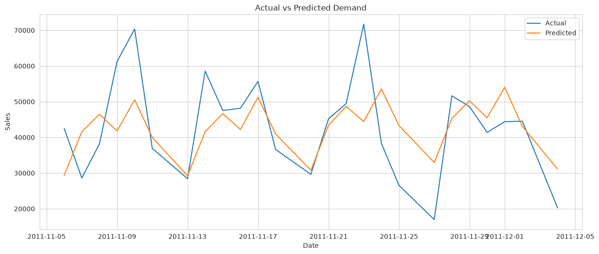
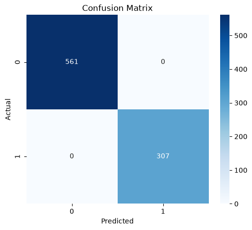

# RetailPulse – Retail Analytics & Customer Intelligence

## 📌 Project Overview

RetailPulse is an end-to-end Retail Analytics and Machine Learning project that analyzes retail transaction data to generate valuable business insights.

The project includes:

- 📊 Exploratory Data Analysis (EDA)
- 🧹 Data Cleaning & Preprocessing
- ⚙️ Feature Engineering
- 👥 Customer Segmentation
- 📈 Demand Forecasting
- 🔍 Customer Churn Prediction
- 📉 Model Evaluation

This project demonstrates a complete machine learning workflow using Python and the Online Retail dataset.

---

## 📂 Dataset

This project uses the **Online Retail Dataset** from the **UCI Machine Learning Repository**.

The dataset contains transactions occurring between **December 2010 and December 2011** for a UK-based online retailer.

### Dataset Features

- Invoice Number
- Stock Code
- Product Description
- Quantity
- Invoice Date
- Unit Price
- Customer ID
- Country

---

## 🛠️ Technologies Used

- Python
- Pandas
- NumPy
- Matplotlib
- Seaborn
- Scikit-learn
- TensorFlow
- Jupyter Notebook
- Git & GitHub

---

## 📁 Project Structure

```
RetailPulse/
│
├── backend/
├── dashboard/
├── data/
│   ├── raw/
│   └── processed/
│
├── docs/
├── models/
├── notebooks/
│   ├── 01_EDA.ipynb
│   ├── 02_Data_Cleaning.ipynb
│   ├── 03_Feature_Engineering.ipynb
│   ├── 04_Customer_Segmentation.ipynb
│   ├── 05_Demand_Forecasting.ipynb
│   ├── 06_Churn_Prediction.ipynb
│   └── 07_Model_Evaluation.ipynb
│
├── scripts/
├── src/
├── tests/
├── requirements.txt
└── README.md
```

---

## 🤖 Machine Learning Modules

### 📊 Exploratory Data Analysis (EDA)

- Data visualization
- Missing value analysis
- Sales trends
- Country-wise analysis

### 🧹 Data Cleaning

- Removed missing values
- Removed duplicate records
- Corrected data types
- Generated cleaned dataset

### ⚙️ Feature Engineering

Created new features including:

- Total Amount
- Year
- Month
- Quarter
- Weekday
- Hour
- Weekend Indicator

### 👥 Customer Segmentation

Implemented customer segmentation using machine learning techniques to identify different customer groups based on purchasing behavior.

### 📈 Demand Forecasting

Built forecasting models to predict future sales trends and demand patterns.

### 🔍 Customer Churn Prediction

Developed a classification model to predict customers likely to stop purchasing.

### 📉 Model Evaluation

Evaluated the machine learning model using:

- Accuracy
- Precision
- Recall
- F1-Score
- Confusion Matrix
- ROC Curve

---

## ✅ Results

- Successfully cleaned and processed retail transaction data.
- Engineered meaningful business features.
- Segmented customers into meaningful groups.
- Built a demand forecasting model.
- Developed a customer churn prediction model.
- Evaluated model performance using standard classification metrics.

## 📸 Screenshots

### 📊 Exploratory Data Analysis



---

### 👥 Customer Segmentation



---

### 📈 Demand Forecasting



---

### 📉 Confusion Matrix



---

### 📈 ROC Curve


## 🚀 How to Run

### Clone the repository

```bash
git clone https://github.com/omkar-avishipuram/RetailPulse.git
```

### Move into the project directory

```bash
cd RetailPulse
```

### Create a virtual environment

```bash
python -m venv .venv
```

### Activate the virtual environment

Linux/macOS

```bash
source .venv/bin/activate
```

Windows

```bash
.venv\Scripts\activate
```

### Install dependencies

```bash
pip install -r requirements.txt
```

### Launch Jupyter Notebook

```bash
jupyter lab
```

---

## 🎯 Future Improvements

- Build an interactive Streamlit dashboard
- Deploy the application to the cloud
- Improve forecasting accuracy
- Add real-time analytics
- Automate model retraining
- Integrate database support

---

## 👨‍💻 Author

**Omkar Avishipuram**

GitHub: https://github.com/omkar-avishipuram

---

## 📄 License

This project is licensed under the MIT License.
